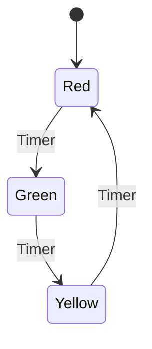
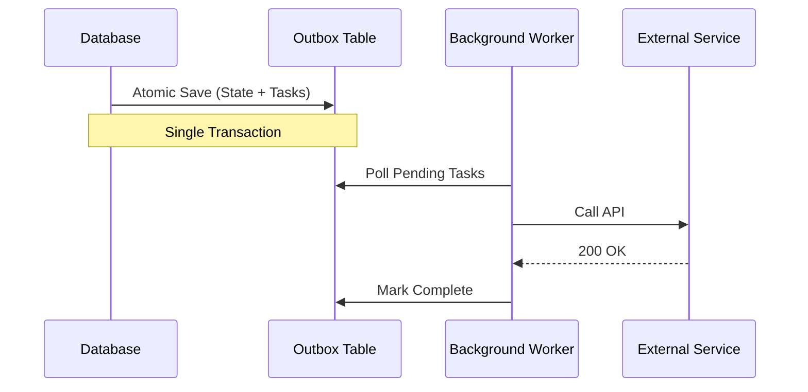

# Everything is a State Machine

> Every bug is a state you didn't account for.

---

## What is a State

A traffic light is always in exactly one situation: red, yellow, or green. It cannot be red and green simultaneously. At any moment it is one thing, and everything around it knows what to do because of that.

That is a state: a specific, exclusive situation a system can be in, which determines what can happen next.

The light also moves between states in defined ways. Green does not jump to red. The rules for moving between states are called transitions.

A state machine is just this: a set of possible states, and the rules for moving between them.



---

## It's Everywhere

Once you see this shape, you find it in everything.

A **button** has states: default, hover, loading, disabled, error. Clicking a loading button should do nothing. That is a transition rule.

An **order** has states: draft, placed, confirmed, shipped, delivered, returned. You cannot ship an unconfirmed order. Also a transition rule.

A **TCP connection** has states: closed, listen, syn-sent, established, time-wait. You cannot send data without the handshake completing. The state machine is the protocol.

A **database** is a known state at any moment, changed only through explicit commands. The write-ahead log is the full history of every transition. Replay it from the beginning and you always arrive at the same result. That is why replication and point-in-time recovery are even possible.

These are not metaphors. They are literally state machines, whether you modeled or think of them that way or not.

---

## Problem 1: Getting the Model Wrong

Let's build a SaaS subscription system:

```csharp
public class Subscription
{
    public bool IsActive { get; set; }
}
```

Fine for now. Then a free trial gets added:

```csharp
public bool IsActive { get; set; }
public bool IsTrial { get; set; }
```

Then payments start failing and you need a grace period. Then cancellations need to take effect at period end:

```csharp
public bool IsActive { get; set; }
public bool IsTrial { get; set; }
public bool IsPastDue { get; set; }
public bool IsCancelled { get; set; }
public DateTime? CancellationDate { get; set; }
```

Four booleans. Sixteen combinations. How many are valid? Maybe three.

What does `IsActive=true, IsCancelled=true, IsPastDue=true` mean? Nobody knows, but that row exists in your database right now.

Each flag arrived with a legitimate feature request. The problem is not carelessness. The problem is that all four flags are trying to describe the same single thing: **what situation is this subscription in right now?** That is a state. You cannot represent one thing with four independent booleans without eventually producing combinations that should never exist.

### The Fix

```csharp
public enum SubscriptionStatus
{
    Trialing,
    Active,
    PastDue,
    Cancelled,
    Expired
}

public class Subscription
{
    public SubscriptionStatus Status { get; set; }
    public DateTime TrialEndsAt { get; set; }
    public DateTime CurrentPeriodEndsAt { get; set; }
}
```

Impossible combinations are now impossible to represent. The type system enforces what reality already knew.

> **Note on functional languages:** Languages with discriminated unions (F#, Rust, Haskell) go further. Data belonging to a `Cancelled` state is literally inaccessible when the subscription is `Trialing`. The bug moves from a runtime crash to a compile-time impossibility.

With the enum model, transitions become explicit decisions:

| Current State | Target State | Event |
| :--- | :--- | :--- |
| `Trialing` | `Active` | Trial ends, payment succeeds |
| `Trialing` | `Expired` | Trial ends, no payment method |
| `Active` | `PastDue` | Payment fails |
| `Active` | `Cancelled` | User cancels |
| `PastDue` | `Active` | Retry succeeds |
| `PastDue` | `Expired` | Grace period ends |
| `Cancelled` | `Active` | User reactivates before period ends |

Two things become obvious when you write this out.

**Every transition is a business decision.** Who decided a cancelled subscription can reactivate? What happens after 7 days past due? These questions existed before. The boolean model just let you avoid answering them. The state model forces you to answer them explicitly, where they belong.

The rule is not "never use booleans." The rule is: **invalid states should be impossible to represent, not just guarded against in code.** A model that achieves this is more honest. And that honesty compounds as the system grows.

---

## Problem 2: Getting the Execution Wrong

Fixing the model solves representation. But even a correct model breaks if transitions are not durable.

When a subscription moves to `PastDue`:

```csharp
public async Task HandlePaymentFailed(Guid subscriptionId)
{
    var subscription = await _db.GetSubscriptionAsync(subscriptionId);
    subscription.Status = SubscriptionStatus.PastDue;
    await _db.SaveAsync(subscription);

    await _email.SendPaymentFailedAsync(subscription.UserId);  // what if this fails?
    await _features.RestrictAsync(subscription.UserId);        // what if this fails?
    await _crm.UpdateStatusAsync(subscription.UserId, "past_due");
}
```

The DB write succeeds. Then the email service goes down. The method exits. Features never restricted. CRM never updated.

You retry the whole method. Now the email fires twice.

The problem: the transition happened, but its consequences did not. You need a way to say "this transition happened, and these things must eventually happen as a result, even if the process dies between now and then."

### The Fix: Ensuring Eventual Consistency of Side Effects


```csharp
public async Task HandlePaymentFailed(Guid subscriptionId)
{
    var subscription = await _db.GetSubscriptionAsync(subscriptionId);
    subscription.Status = SubscriptionStatus.PastDue;

    var tasks = new List<OutboxTask>
    {
        new OutboxTask("send-payment-failed-email", subscription.UserId),
        new OutboxTask("restrict-features", subscription.UserId),
        new OutboxTask("update-crm-past-due", subscription.UserId),
    };

    await _db.SaveAsync(subscription, tasks); // atomic: both or neither
}
```

A background worker picks up each task independently. If email is down, that task retries. The others are not affected. The subscription is already in the right state. Nothing runs twice.



You did not arrive here by thinking "I need a queue." You arrived here by asking: **what does it mean for a transition to be complete?**

A transition is not complete when the status column changes. It is complete when all its consequences have been delivered.

### How Far You Need to Go

The outbox pattern is one point on a spectrum. Where you land depends on what your system can afford to lose mid-transition:

- **DB transaction + background worker:** cheap, handles most cases
- **Message broker:** consequences become independent services, each retrying on their own
- **Durable execution** (Temporal, Restate): entire workflows survive process failures and can resume at any point

What moves you along the spectrum is not ambition. It is the cost of losing a transition halfway through.

---

## Problem 3: Migrating an Honest Model

Modeling state correctly from the start is straightforward. The real tradeoff shows up when you need to change a model that is already in production.

Adding a new state like `Paused` to a 10-million-row subscriptions table is a migration. That migration has risk: downtime, locking, rollback complexity. The temptation is to add a quick `IsPaused` boolean instead. No migration needed, ships today.

Sometimes you take that shortcut to hit a deadline. Just call it what it is: you are trading a more honest model tomorrow for a faster ship today. The goal is not to never make this tradeoff. It is to make it consciously, understand the interest you are paying, and reduce how often it happens.

---

## Tools and Techniques Through This Lens

Software has many dimensions to evaluate when choosing tools and techniques: performance, cost, operational complexity, team familiarity, and more. But once you have a state model, one useful lens is to look at tools and techniques through it. How do you need to represent state? What guarantees do your transitions require? What failures can you afford mid-transition? The answers narrow the space considerably.
| Tool / Technique | State problem it addresses |
| :--- | :--- |
| **Redis** | State needs to outlive the process |
| **Message broker** | Transitions need to be durable and decoupled |
| **Optimistic / pessimistic locking** | Two actors must not transition the same state simultaneously |
| **Temporal / Restate** | Workflows must survive infra failures mid-transition |
| **Event sourcing** | State needs a complete, replayable history of every transition |

This is not the only dimension worth considering. But it is a clarifying one.

---

## Your Model Must Survive New Requirements

Every new requirement needs somewhere to land. It needs to attach to states that already exist, or introduce new ones cleanly. When your model honestly reflects reality, there is a clear place for new things to fit.

When it does not, every change becomes harder than the one before. You end up building on top of a model that was already wrong, and the cost compounds quietly until it becomes expensive to change anything at all.

Think of the subscription system. Once you have explicit states and transitions, a new requirement like "pause a subscription for up to 3 months" has a clear shape. You add a `Paused` state, define its transitions, answer the business questions it raises, and ship it. The model absorbs it cleanly.

---

## Context Awareness

One more thing worth naming: the same entity means different things in different parts of your system.

A subscription in your billing service is not the same as a subscription in your feature flags service or your analytics service. Each context cares about different states and different transitions. Billing cares about `PastDue` and `Expired`. Feature flags care about `Active` and `Cancelled`. Analytics might not care about state at all, just the history of transitions.

Trying to build one subscription model that serves all of them is how systems quietly become impossible to change. Model the entity as your part of the system actually sees it.

---

## My Take
You cannot model the future. But the future grows from whatever you modeled today. The question is not whether your model is perfect. It is whether it is honest about what you know right now.
